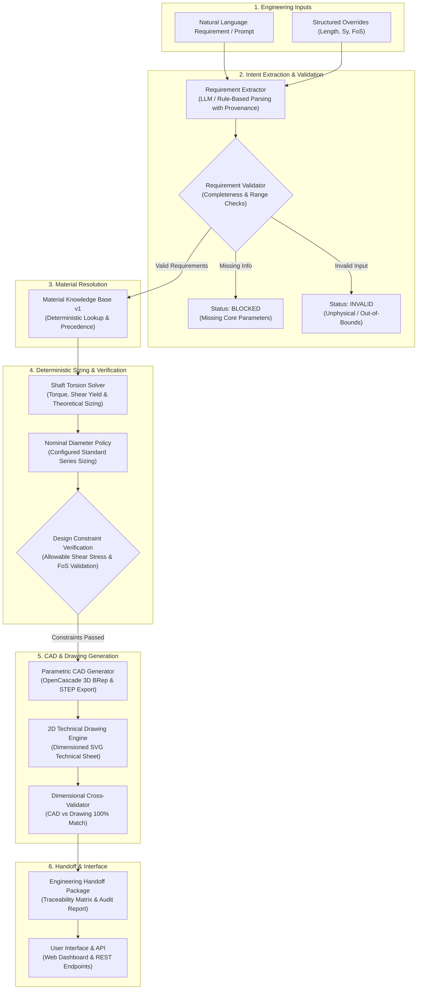

# AI-Assisted Engineering Design Automation

> Natural-language engineering requirements -> structured engineering specifications -> material knowledge resolution -> deterministic design calculations -> validated CAD artifacts.

An engineering design-assistance platform that translates natural-language engineering requirements into structured parameters, resolves material properties against a deterministic knowledge base, executes closed-form mechanical sizing equations, synthesizes parametric 3D BRep CAD models, and exports 2D technical drawings with dimensional cross-validation.

---

## Central Design Philosophy

```
Natural Language / Drawing Intent (AI & Computer Vision)
                       ↓
Structured Requirements & Material Knowledge Base (Deterministic)
                       ↓
Closed-Form Mechanical Engineering Solver (Deterministic Mathematics)
                       ↓
Explicit Engineering Policies (Configured Nominal Sizing)
                       ↓
Parametric CAD & 2D Technical Drawings (OpenCascade / BRep)
                       ↓
Dimensional Cross-Validation Matrix & Engineering Handoff Package
```

> **Core Principle**: AI handles ambiguity, language interpretation, and visual semantic extraction; deterministic engineering software handles calculations, material properties, constraints, nominal sizing, and CAD generation.

The LLM is strictly an interpreter of engineering intent. It **never** performs engineering arithmetic, torque calculation, stress analysis, factor of safety estimation, or geometry synthesis.

---

## 1. Overview

Mechanical engineering workflows often require translating high-level operational requirements into preliminary component sizing, material selection, standard nominal dimensioning, and 3D/2D CAD models.

This system automates this progression as a **Transmission Shaft Design Vertical Slice (V1)**:
- **Input**: A natural-language problem statement (e.g., *"Design a solid transmission shaft transmitting 7.5 kW at 1200 RPM using AISI 1045 steel with a factor of safety of 2.2"*), optionally augmented with structured overrides.
- **Processing**: Extracts structured requirements with field-level provenance, resolves material properties via an authoritative Material Knowledge Base, calculates torsional shear stresses, applies an explicit metric nominal diameter selection policy, and verifies yield-strength design constraints.
- **Output**: Generates ISO-10303-21 STEP CAD models, vector-rendered 2D SVG engineering drawings, an automated dimensional cross-validation matrix, and an auditable Engineering Handoff package.

---

## 2. What It Demonstrates

- **Natural-Language Requirement Interpretation**: Extracts power, rotational speed, factor of safety, length, and material designations with exact source-text span provenance and confidence tracking.
- **Material Knowledge Base (v1)**: Deterministic lookup supporting standard designations (`S235JR`, `S275JR`, `S355J2`, `AISI 1018`, `AISI 1045`, `AISI 4140`, `AISI 304`, `6061-T6`) with authoritative standards metadata (EN 10025-2, ASTM A29/A108/A240/B221, ISO 683).
- **Anti-Hallucination & Override Hierarchy**: Generic material terms (e.g. `"steel"`) without explicit yield strength strictly halt as `BLOCKED`. Explicit user yield strength overrides database values with full audit trail tracking (`"Explicit override"`).
- **Closed-Form Torsional Sizing**: Analytical torque calculation, von Mises distortion-energy shear yield conversion ($S_{sy} = 0.57735 \cdot S_y$), allowable shear stress calculation, and minimum theoretical diameter derivation.
- **Configured Nominal Diameter Policy**: Sizing policy selecting the smallest standard diameter from an explicit metric series (`[6, 8, 10, 12, 14, ..., 200 mm]`) with out-of-bounds protection.
- **Yield-Strength Constraint Verification**: Evaluates design torsional shear stress ($\tau_{\\text{design}}$) and achieved factor of safety against allowable limits.
- **Parametric 3D Solid CAD Synthesis**: OpenCascade BRep solid model synthesis with analytical volume verification ($0.0000\%$ error against theoretical).
- **2D Technical Drawing Derivation**: Orthographic projection with dimension callouts, leader lines, and standard engineering title block metadata.
- **CAD <-> Drawing Dimensional Cross-Validation**: Automated cross-validation verifying that drawing annotations exactly match 3D solid geometry (100% agreement check).
- **Engineering Design Review Web Console**: Interactive browser console (`/ui`) providing live SVG viewports, derivation step trees, traceability matrices, and downloadable STEP artifacts.
- **Deterministic Test Suite**: **424 passing automated tests across 28 test suites** covering nominal sizing, failure paths, material resolution, and API contracts.

---

## 3. Architecture



---

## 4. Engineering Workflow

### Verified Reference Execution

**Input Requirement**:
> *"Design a solid circular transmission shaft made of AISI 1045 to transmit 7.5 kW at 1200 RPM with a factor of safety of 2.2."* (Length: $L = 350.0\text{ mm}$)

**Execution Chain**:
1. **Extraction & Provenance**:
   - $P = 7.5\\text{ kW}$, $N = 1200.0\\text{ RPM}$, $\\text{FoS}_{\\text{req}} = 2.2$, $L = 350.0\text{ mm}$, Material: `AISI 1045` (Confidence: 1.0)
2. **Material Knowledge Resolution**:
   - Resolved Record: `AISI 1045` (Normalized condition per ASTM A29 / ISO 683-1)
   - Yield Strength: $S_y = 310.0\\text{ MPa}$ (Source: Knowledge Base, Status: `Verified`)
3. **Deterministic Mechanical Sizing**:
   - Angular speed: $\\omega = \\frac{2\\pi \\cdot 1200}{60} = 125.6637\\text{ rad/s}$
   - Transmitted torque: $T = \\frac{P}{\\omega} = \\frac{7500\\text{ W}}{125.6637\\text{ rad/s}} = 59.683\\text{ N}\\cdot\\text{m}$
   - Shear yield strength (von Mises): $S_{sy} = 0.57735 \\cdot 310.0\\text{ MPa} = 178.98\\text{ MPa}$
   - Allowable shear stress: $\\tau_{\\text{allow}} = \\frac{S_{sy}}{\\text{FoS}_{\\text{req}}} = \\frac{178.98\\text{ MPa}}{2.20} = 81.35\\text{ MPa}$
   - Theoretical minimum diameter:
     $$d_{\\text{req}} = \\left( \\frac{16 \\cdot T}{\\pi \\cdot \\tau_{\\text{allow}}} \\right)^{1/3} = \\left( \\frac{16 \\cdot 59.683}{\\pi \\cdot 8.135 \\times 10^7} \\right)^{1/3} = 15.52\text{ mm}$$
4. **Configured Nominal Diameter Selection**:
   - Series Policy: `metric_nominal_shaft_series_r20_custom` (`[6, 8, 10, 12, 14, 15, 16, 18, 20, ..., 200 mm]`)
   - Selected: $d_{\\text{nominal}} = 16.0\text{ mm}$ (Smallest standard diameter $\\ge 15.52\text{ mm}$)
5. **Stress Evaluation & Constraint Validation**:
   - Design torsional shear stress: $\\tau_{\\text{design}} = \\frac{16 \\cdot 59.683}{\\pi \\cdot (0.0160)^3} = 74.21\\text{ MPa}$
   - Achieved Factor of Safety: $\\text{FoS}_{\\text{achieved}} = \\frac{178.98\\text{ MPa}}{74.21\\text{ MPa}} = 2.41$
   - Constraint Check: `Yield-Strength Design Constraint Satisfied (τ_design ≤ τ_allow)`
6. **CAD, 2D Drawing & Cross-Validation**:
   - 3D BRep Volume: $70,371.68\text{ mm}^3$ (Theoretical: $70,371.68\text{ mm}^3$, Error: $0.0000\\%$)
   - STEP Export: `shaft_16x350.stp` (3,237 bytes)
   - 2D Drawing: `shaft_16x350_drawing.svg` (6,242 bytes)
   - Dimensional Agreement: Diameter Match (16.0 mm == 16.0 mm), Length Match (350.0 mm == 350.0 mm) -> **100% Match**.

---

## 5. Material Knowledge Base (V1)

The Material Knowledge Base provides deterministic lookup backed by published international standards without LLM interpolation.

### Curated V1 Material Dataset

| Identifier | Designation | Category | $S_y$ (MPa) | $S_{ut}$ (MPa) | $E$ (GPa) | $\\nu$ | $\\rho$ ($\\text{kg/m}^3$) | Standard / Condition Reference |
|---|---|---|---|---|---|---|---|---|
| `mat_s235jr` | **S235JR** | Structural Steel | 235.0 | 360.0 | 210.0 | 0.30 | 7850 | EN 10025-2:2019 Table 7 ($t \\le 16\text{ mm}$) |
| `mat_s275jr` | **S275JR** | Structural Steel | 275.0 | 430.0 | 210.0 | 0.30 | 7850 | EN 10025-2:2019 Table 7 ($t \\le 16\text{ mm}$) |
| `mat_s355j2` | **S355J2** | Structural Steel | 355.0 | 510.0 | 210.0 | 0.30 | 7850 | EN 10025-2:2019 Table 7 ($t \\le 16\text{ mm}$) |
| `mat_aisi_1018` | **AISI 1018** | Carbon Steel | 370.0 | 440.0 | 205.0 | 0.29 | 7870 | ASTM A29 / ASTM A108 (Cold Drawn) |
| `mat_aisi_1045` | **AISI 1045** | Carbon Steel | 310.0 | 565.0 | 206.0 | 0.29 | 7850 | ASTM A29 / ISO 683-1 (Normalized) |
| `mat_aisi_4140` | **AISI 4140** | Alloy Steel | 655.0 | 930.0 | 210.0 | 0.30 | 7850 | ASTM A29 / ISO 683-2 (Q&T @ 600°C) |
| `mat_aisi_304` | **AISI 304** | Stainless Steel | 205.0 | 515.0 | 193.0 | 0.29 | 8000 | ASTM A240 / EN 10088-2 ($R_{p0.2}$) |
| `mat_al_6061_t6` | **6061-T6** | Aluminum Alloy | 276.0 | 310.0 | 68.9 | 0.33 | 2700 | ASTM B221 / EN 755-2 (T6 Temper) |

> **Engineering Note**: Material properties in engineering practice depend on heat treatment, temper, section thickness, manufacturing process, and operating temperature. Values in V1 represent baseline nominal conditions cited from the listed standards.

### Resolution Precedence Hierarchy

$$\\text{Explicit Structured Input} > \\text{Explicit Prompt Requirement} > \\text{Knowledge Base Lookup} > \\text{Unresolved / BLOCKED}$$

- **Explicit Override**: If a user specifies `"material": "S355"` and `"yield_strength_mpa": 280.0`, the explicit $280\\text{ MPa}$ takes precedence and the discrepancy is logged as `"Explicit override"`.
- **Generic Term Blocking**: Generic material inputs like `"steel"` or `"aluminum"` without specific grade or explicit $S_y$ remain strictly **`BLOCKED`**. The system **never** silently substitutes S355 or any other default.

---

## 6. Engineering Calculation Model

The V1 solver models a solid circular transmission shaft subjected to pure steady torsional loading:

1. **Angular Velocity**:
   $$\\omega = \\frac{2\\pi \\cdot N}{60} \\quad [\\text{rad/s}]$$
2. **Transmitted Torque**:
   $$T = \\frac{P \\cdot 1000}{\\omega} \\quad [\\text{N}\\cdot\\text{m}]$$
3. **Shear Yield Strength (von Mises Distortion Energy Theory)**:
   $$S_{sy} = \\frac{1}{\\sqrt{3}} \\cdot S_y \\approx 0.57735 \\cdot S_y \\quad [\\text{MPa}]$$
4. **Allowable Torsional Shear Stress**:
   $$\\tau_{\\text{allow}} = \\frac{S_{sy}}{\\text{FoS}_{\\text{required}}} \\quad [\\text{MPa}]$$
5. **Theoretical Required Diameter**:
   $$d_{\\text{req}} = \\left( \\frac{16 \\cdot T}{\\pi \\cdot \\tau_{\\text{allow}}} \\right)^{1/3} \\quad [\\text{m}]$$
6. **Configured Nominal Diameter Selection**:
   $$d_{\\text{nominal}} = \\min \\{ d \\in \\mathcal{S}_{\\text{nominal}} \\mid d \\ge d_{\\text{req}} \\}$$
   Where $\\mathcal{S}_{\\text{nominal}} = [6, 8, 10, 12, 14, 15, 16, 17, 18, 20, 22, 24, 25, 28, 30, \\dots, 200]\text{ mm}$.
7. **Design Stress & Achieved Factor of Safety**:
   $$\\tau_{\\text{design}} = \\frac{16 \\cdot T}{\\pi \\cdot d_{\\text{nominal}}^3}, \\quad \\text{FoS}_{\\text{achieved}} = \\frac{S_{sy}}{\\tau_{\\text{design}}}$$
8. **Design Constraint Check**:
   $$\\tau_{\\text{design}} \\le \\tau_{\\text{allow}} \\quad \\land \\quad \\text{FoS}_{\\text{achieved}} \\ge \\text{FoS}_{\\text{required}}$$

---

## 7. CAD and Drawing Output

- **3D Solid Modeling**: Synthesizes exact parametric cylindrical solids via OpenCascade with deterministic geometric fallback.
- **BRep Solid Validation**: Evaluates solid topology and analytical volume accuracy against theoretical geometry ($\\text{Error} \\le 0.001\\%$).
- **ISO-10303-21 STEP Export**: Exports production-ready STEP CAD models.
- **2D Technical Drawings (SVG)**: Renders orthographic projections including centerlines, linear/diameter dimension callouts, projection tags, and engineering title block metadata.
- **Dimensional Cross-Validation**: Inspects generated drawing dimension values against actual CAD BRep dimensions, asserting exact parity before release.

---

## 8. Web Interface

The web interface is hosted at **`/ui`** (redirected from `/` and `/design-review`).

### Features:
- **Prompt Console**: Natural-language input with one-click example chips (e.g. Standard 5 kW Shaft, Custom 280 MPa Override, Blocked Generic Steel).
- **Interactive Review Tabs**:
  1. **Requirements & Extraction**: Extracted specification table with explicit confidence and source text spans.
  2. **Engineering Sizing**: Step-by-step mathematical derivations, intermediate equations, and yield-strength constraint verification.
  3. **2D Technical Drawing**: Interactive SVG viewport with full vector zooming and direct SVG download.
  4. **Traceability Matrix**: Multi-column matrix comparing Prompt Origin -> Analytical Solver -> 3D CAD -> 2D Drawing dimensions.
  5. **Artifact Package**: Download cards for generated ISO-10303-21 STEP models and SVG drawings.
  6. **Audit Report**: Formatted markdown engineering handoff report with full parameter provenance.

---

## 9. API Reference

### Canonical Endpoint: `POST /design/pipeline`

Executes the complete end-to-end requirement extraction, material resolution, sizing, CAD, drawing, and validation sequence.

**Request Schema**:
```json
{
  "problem_statement": "Design a solid transmission shaft transmitting 7.5 kW at 1200 RPM using AISI 1045 steel with a factor of safety of 2.2.",
  "engineering_inputs": {
    "length_mm": 350.0
  },
  "output_dir": null
}
```

**Response Schema**:
```json
{
  "status": "SUCCESS",
  "spec": {
    "component": "shaft",
    "material": "AISI 1045",
    "power_kw": 7.5,
    "rpm": 1200.0,
    "factor_of_safety": 2.2,
    "length_mm": 350.0,
    "yield_strength_mpa": 310.0,
    "provenance": { }
  },
  "material_resolution": {
    "requested_material": "AISI 1045",
    "resolved": true,
    "resolved_material": "AISI 1045",
    "standard": "ASTM A29 / ISO 683-1",
    "yield_strength_mpa": 310.0,
    "yield_strength_source": "Knowledge Base (ASTM A29 / ISO 683-1)",
    "status": "Verified",
    "is_explicit_override": false
  },
  "solver_result": {
    "is_valid": true,
    "status": "VALID",
    "torque_nm": 59.683,
    "allowable_stress_mpa": 81.35,
    "minimum_required_diameter_mm": 15.52,
    "selected_diameter_mm": 16.0,
    "design_stress_mpa": 74.21,
    "achieved_factor_of_safety": 2.41,
    "is_safe": true,
    "diameter_selection_policy": "metric_nominal_shaft_series_r20_custom",
    "calculation_steps": [ ]
  },
  "cad_status": "GENERATED",
  "cross_validation": {
    "diameter_matches": { "drawing_value": 16.0, "cad_value": 16.0, "match": true },
    "length_matches": { "drawing_value": 350.0, "cad_value": 350.0, "match": true },
    "all_match": true
  },
  "artifacts": {
    "step": { "filename": "shaft_16x350.stp", "file_path": "/path/to/shaft_16x350.stp" },
    "svg": { "filename": "shaft_16x350_drawing.svg", "file_path": "/path/to/shaft_16x350_drawing.svg" }
  },
  "report": "# End-to-End Mechanical Design Pipeline Report..."
}
```

### Additional Endpoints

| Endpoint | Method | Role |
|---|---|---|
| `/ui` | `GET` | Web console for engineering design review |
| `/artifacts/{path}` | `GET` | Static artifact downloads (STEP / SVG) |
| `/design/cad` | `POST` | Dedicated parametric CAD and 2D drawing synthesis |
| `/design/specification` | `POST` | Requirement interpretation & analysis planning |
| `/design` | `POST` | Legacy candidate-search design endpoint (Slice 12) |
| `/analyze` | `POST` | 2D drawing computer vision feature extraction |
| `/reason` | `POST` | Evidence-grounded drawing reasoning |

---

## 10. Project Structure

```text
src/
├── api/                        # FastAPI routers and application entrypoint
│   ├── main.py                 # App initialization, static mounts (/ui, /artifacts)
│   └── routes.py               # /design/pipeline, /design/cad, /analyze endpoints
├── cad/                        # 3D CAD & 2D Technical Drawing Engine (Slice 13)
│   ├── backend.py              # OpenCascade / deterministic BRep fallback adapter
│   ├── brep.py                 # Solid topology, face, and volume validation
│   ├── drawing.py              # 2D projection, dimension callouts & SVG rendering
│   ├── exporters.py            # ISO-10303-21 STEP file exporter
│   ├── generator.py            # CADSpecification -> CADResult synthesis
│   └── handoff.py              # Engineering handoff container creation
├── design_engine/              # Legacy candidate-search design engine (Slice 12)
│   ├── designer.py             # Multi-objective shaft design synthesis
│   └── shaft.py                # Closed-form shaft equations & diameter calculations
├── knowledge/                  # Engineering Knowledge & Rules
│   ├── materials/              # Material Knowledge Base (v1)
│   │   ├── schema.py           # Pydantic MaterialRecord & validation result models
│   │   ├── registry.py         # Schema-validated JSON loader & registry
│   │   ├── repository.py       # Deterministic lookup, normalization & override logic
│   │   └── data/
│   │       └── materials.json  # Authoritative EN/ASTM/ISO material property records
│   └── tests/
│       └── test_materials.py   # Material schema, lookup, override & pipeline tests
├── requirements/               # Deterministic Requirements & Pipeline Orchestration
│   ├── diameter_policy.py      # Configured standard metric nominal diameter series
│   ├── extractor.py            # Grounded requirement extraction & field provenance
│   ├── models.py               # EngineeringSpec, EngineeringResult, EndToEndDesignResult
│   ├── pipeline.py             # End-to-end design pipeline orchestrator
│   ├── solver.py               # Deterministic closed-form shaft engineering solver
│   ├── validator.py            # Physical & schema constraint validator
│   └── tests/                  # Pipeline, extractor, solver & diameter policy tests
├── solvers/                    # Deterministic Engineering Physics Solvers
│   ├── torsion.py              # Closed-form torsion analysis
│   ├── bending.py              # Beam bending solver
│   └── combined_stress.py      # Principal & von Mises combined stress solver
├── ui/                         # Design Review Web Console
│   ├── index.html              # Clean dark-mode engineering console UI
│   ├── style.css               # Design tokens, typography, and responsive styling
│   └── app.js                  # Frontend logic & live drawing rendering (zero UI math)
└── tests/                      # Full test suite (API, CAD, solvers, vision, UI)
```

---

## 11. Validation & Testing

The repository maintains **424 passing automated tests across 28 test suites** with zero failures:

```text
============================= test session starts ==============================
platform linux -- Python 3.12.14, pytest-9.1.1, pluggy-1.6.0
rootdir: /home/aad_dev95/mechai-engineering-drawing-intelligence
plugins: anyio-4.15.1
collected 424 items

424 passed in 9.49s
```

### Verified Test Areas:
- **Material Knowledge Base**: Schema validation, boundary checks, case/whitespace normalization, explicit $S_y$ override, and generic steel blocking.
- **Analytical Physics Solvers**: Torsion, bending, combined stress, distortion energy theory, and unit conversions.
- **Diameter Selection Policy**: Boundary tests (e.g. $d_{\\text{req}} = 11.999999\text{ mm} \\to d_{\\text{nominal}} = 12.0\text{ mm}$) and maximum diameter bounds.
- **CAD & Drawing Integration**: OpenCascade solid synthesis, theoretical volume verification ($0.0000\\%$ error), STEP export, and CAD <-> drawing dimensional cross-validation.
- **Failure Paths**: Missing parameters (length, yield strength, power, speed) halt cleanly with `BLOCKED`/`INVALID` status without triggering CAD generation.
- **API & UI Contracts**: Full endpoint contracts, static file serving, and error handling.

---

## 12. Running Locally

### Prerequisites
- Linux / WSL / macOS
- Python 3.12+

### Setup & Installation

1. **Clone Repository**:
   ```bash
   git clone https://github.com/aadil-lang/Engineering-design-automation.git
   cd Engineering-design-automation
   ```

2. **Create and Activate Virtual Environment**:
   ```bash
   python3 -m venv .venv
   source .venv/bin/activate
   ```

3. **Install Dependencies**:
   ```bash
   pip install -r requirements.txt
   ```

4. **Run the Automated Test Suite**:
   ```bash
   PYTHONPATH=src pytest -v
   ```

5. **Start the API & Web Console**:
   ```bash
   PYTHONPATH=src uvicorn api.main:app --host 0.0.0.0 --port 8000
   ```

6. **Access Web Console**:
   Open **`http://localhost:8000/ui`** in your browser.

---

## 13. Example API Request

```bash
curl -X POST "http://localhost:8000/design/pipeline" \
  -H "Content-Type: application/json" \
  -d '{
    "problem_statement": "Design a solid transmission shaft transmitting 7.5 kW at 1200 RPM using AISI 1045 steel with a factor of safety of 2.2.",
    "engineering_inputs": {
      "length_mm": 350.0
    }
  }'
```

---

## 14. Design Principles

- **Separation of Concerns**: AI handles natural-language intent and visual semantics; deterministic Python code handles equations, materials, and CAD generation.
- **Zero Fabricated Mathematics**: The system never guesses or estimates engineering values. If inputs are missing, execution halts cleanly with `BLOCKED`.
- **Explicit Material Provenance**: Material properties cite published standards and explicitly track whether a property originated from user input or database lookup.
- **Dimensional Parity**: 2D drawing callouts must cross-validate against 3D solid geometry before release.
- **Constraint-Based Terminology**: Uses precise engineering descriptions (`"Yield-Strength Design Constraint Satisfied"`) rather than unwarranted safety or certification claims.

---

## 15. Scope & Limitations

### Current Scope (V1)
- **Component**: Solid circular transmission shafts under steady torsional loading.
- **Materials**: Standard engineering grades in baseline nominal conditions (EN 10025-2, ASTM A29/A108/A240/B221, ISO 683).
- **Nominal Sizes**: Standard metric series from $6.0\text{ mm}$ to $200.0\text{ mm}$.

### Engineering Disclaimer
> **Disclaimer**: This system is an automated engineering design-assistance prototype. Generated calculations, CAD models, and technical drawings are preliminary sizing outputs. They do not constitute formal manufacturing approval or certified professional engineering sign-off. All outputs must be reviewed and approved by a qualified engineer before production release.

---

## 16. Roadmap

- **V1 (Current)**: Transmission shaft design vertical slice with Material Knowledge Base, analytical solver, OpenCascade STEP CAD, 2D drawings, dimensional cross-validation, and review UI.
- **V1.x**: CI/CD automation, production containerization, and multi-tenant artifact access.
- **V2**: Additional machine element solvers (stepped shafts, keyways, bearings, couplings, bolted joints).
- **V3**: Multi-load combined stress analysis (combined torsion, bending, axial, fatigue life).
- **V4**: Multi-component assembly reasoning and automated Bill of Materials (BOM) validation.

---

## 17. Why This Project Matters

Translating ambiguous natural-language intent into preliminary mechanical designs while maintaining **absolute mathematical determinism, standards-backed material provenance, and dimensional cross-validation** represents the core challenge of applied AI in engineering.

This project demonstrates how AI and classical engineering software can be combined reliably without allowing stochastic models to compute physical dimensions.

---

## 18. Domain Background & Author Context

This project is authored by a **Mechanical Engineering graduate (B.Tech in Mechanical Engineering)** and is informed by academic training in machine design and hands-on experience with parametric CAD.

### Engineering Foundations

Relevant academic foundations include:

* **Design of Machine Elements / Machine Design**
* **Strength of Materials**
* Mechanical engineering drawing and design principles
* Failure criteria, including **von Mises distortion-energy theory** and **maximum shear stress theory**
* Factor-of-safety based design calculations

### CAD & Mechanical Design

The author has prior hands-on experience with **PTC Creo Parametric**, including 3D parametric solid modeling, dimensional modeling, and orthographic drafting workflows.

This background informed the engineering assumptions and system boundaries used throughout the project, while the software implementation applies those principles through a deterministic, testable engineering pipeline.

### How the Domain Background Influenced the Architecture

1. **Strict Separation of AI from Engineering Mechanics**

   Language models are used for interpreting engineering intent and extracting structured requirements. Engineering calculations such as torque, allowable stress, shaft sizing, and factor-of-safety evaluation are performed by deterministic engineering logic rather than generated by an LLM.

2. **Explicit Nominal Sizing Policy**

   The system distinguishes between a theoretically calculated dimension and the nominal dimension selected by the configured design policy. For example, a calculated required diameter of `15.52 mm` can result in a configured nominal diameter of `16.0 mm`.

3. **CAD and Drawing Cross-Validation**

   The workflow reflects conventional mechanical-design review practices by checking that key dimensions represented in the generated 2D drawing are consistent with the corresponding 3D CAD geometry before the design is handed off.

4. **Engineering Traceability**

   Material properties, derived engineering quantities, design decisions, validation results, and generated artifacts are kept traceable through the pipeline rather than treating the final CAD model as an unexplained AI-generated output.

> **Context note:** This background describes the domain knowledge that informed the project architecture. It is not a claim of licensed professional engineering certification, regulatory approval, or current commercial mechanical-design employment.
